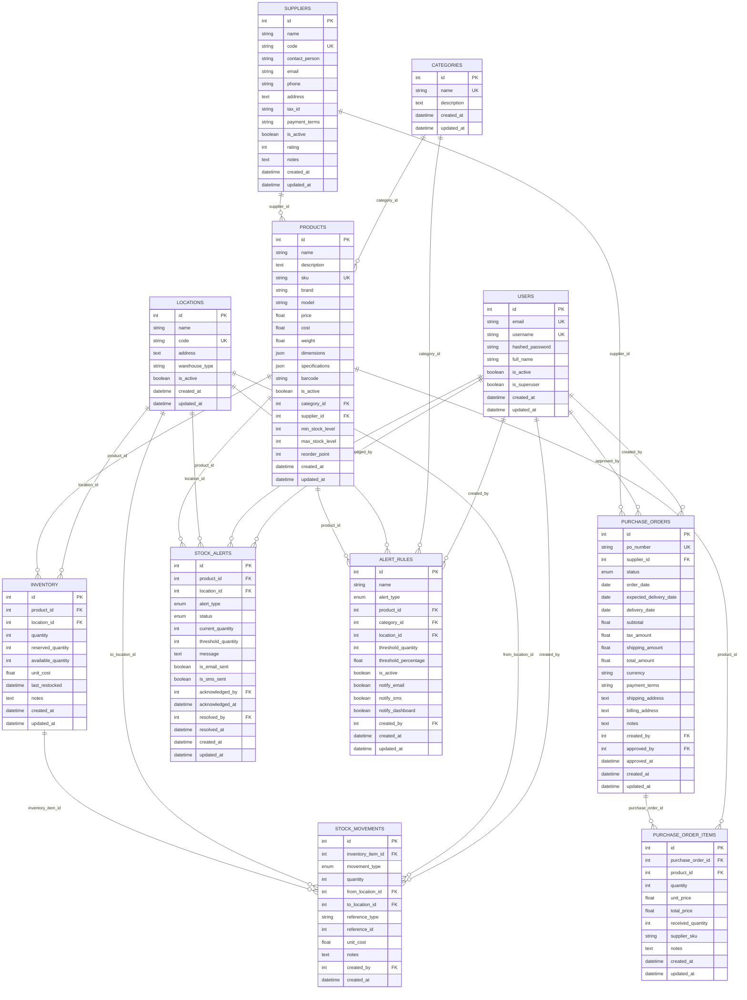

# Database Entity Relationship Diagram (ERD)

## Visual Database Schema

## Key Relationship Types

### One-to-Many (1:N) Relationships
- **Users → Purchase Orders**: One user can create/approve many purchase orders
- **Categories → Products**: One category can have many products
- **Suppliers → Products**: One supplier can supply many products
- **Suppliers → Purchase Orders**: One supplier can have many purchase orders
- **Locations → Inventory**: One location can have many inventory items
- **Products → Inventory**: One product can be in many locations
- **Products → Purchase Order Items**: One product can be in many purchase orders
- **Products → Stock Alerts**: One product can have many alerts
- **Inventory → Stock Movements**: One inventory item can have many movements

### Many-to-One (N:1) Relationships
- **Products → Categories**: Many products can belong to one category
- **Products → Suppliers**: Many products can be supplied by one supplier
- **Inventory → Products**: Many inventory items can reference one product
- **Inventory → Locations**: Many inventory items can be in one location
- **Purchase Orders → Suppliers**: Many purchase orders can be with one supplier
- **Purchase Order Items → Products**: Many items can reference one product

### Self-Referencing Relationships
- **Users → Users**: Users can approve purchase orders created by other users
- **Locations → Locations**: Stock movements can transfer between locations

## Database Constraints

### Primary Keys
- All tables have auto-incrementing integer primary keys
- Composite keys are used where needed (e.g., inventory: product_id + location_id)

### Foreign Keys
- All relationships are properly enforced with foreign key constraints
- Cascade delete is used where appropriate (e.g., purchase order items)

### Unique Constraints
- Email and username in users table
- SKU in products table
- PO number in purchase orders table
- Category name
- Supplier code
- Location code

### Check Constraints
- Stock quantities cannot be negative
- Prices and costs must be positive
- Alert thresholds must be reasonable values

## Indexes for Performance

### Primary Indexes
- All primary keys are automatically indexed

### Foreign Key Indexes
- All foreign key columns are indexed for join performance

### Unique Indexes
- Email, username, SKU, PO number, etc.

### Composite Indexes
- Inventory: (product_id, location_id)
- Stock movements: (inventory_item_id, created_at)
- Purchase order items: (purchase_order_id, product_id)

### Performance Indexes
- Created_at columns for date range queries
- Status columns for filtering
- Name columns for search functionality 